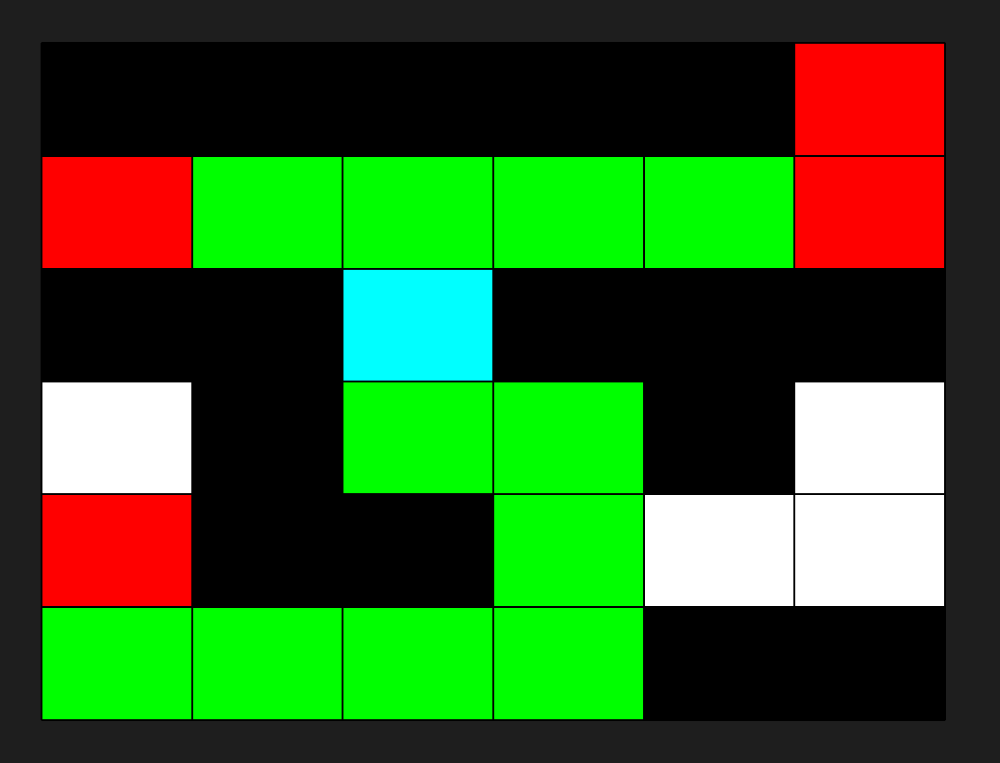
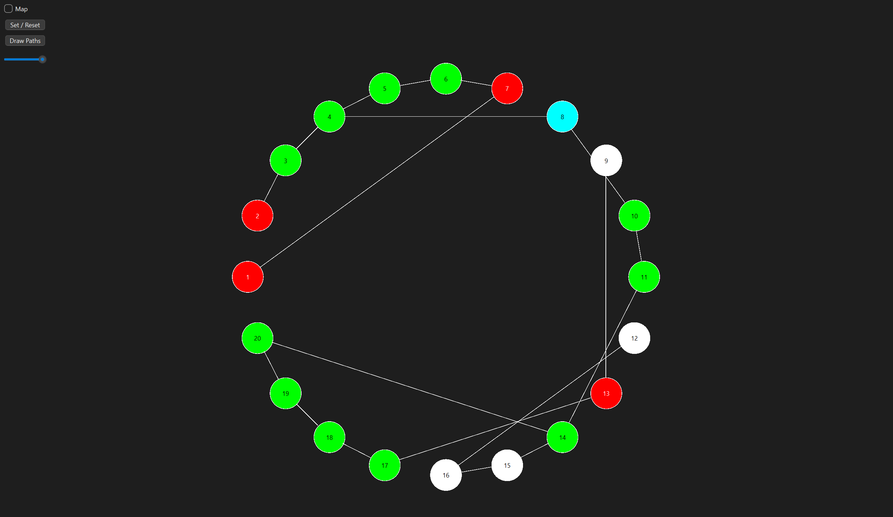

# Labyrinth Solver using BFS (Qt C++ Project)

## Overview
This project is a C++ application built with Qt that solves a labyrinth using the Breadth-First Search (BFS) algorithm. The labyrinth is represented as a graph and can be visualized both in a graphical format and as a traditional labyrinth.




## Features
- Load labyrinths from a file
- Represent the labyrinth as a graph
- Solve the labyrinth using BFS
- Visualize the solution in both graph and labyrinth views
- Animated labyrinth solution
- Interactive GUI using Qt
- Adjustable visualization settings

## Technologies Used
- **C++** for core logic
- **Qt Framework** for GUI and visualization
- **BFS Algorithm** for pathfinding


## Compilation & Execution
### Prerequisites
- Install Qt (Qt Creator)


### Build Instructions
Open the project in Qt Creator, set paths and build it directly.


## Usage
1. Load a labyrinth from a text file (`labyrinth.txt`).
2. Click the **Draw Paths** button to find paths using BFS.
3. Toggle between **Graph View** and **Labyrinth View**.
4. Adjust the visualization settings using the UI controls.

## Example Labyrinth File (`labyrinth.txt`)
```
5 5
1 1 1 1 1
1 0 0 0 1
1 0 3 0 1
1 0 2 0 1
1 1 1 1 1
```
- `0` - Open path
- `1` - Wall
- `2` - Exit
- `3` - Entrance

